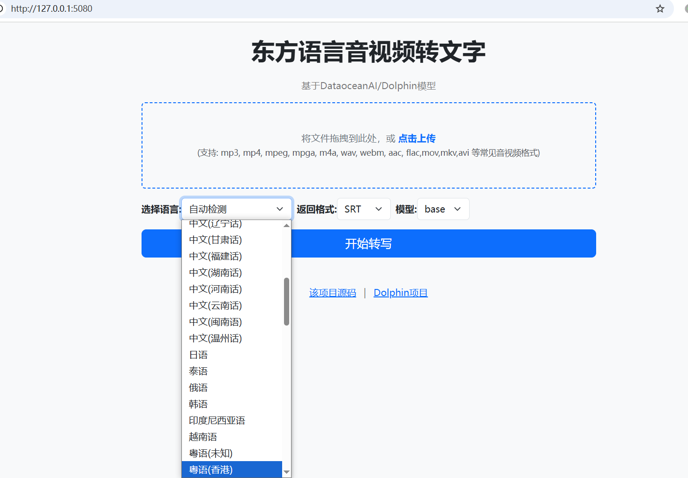

## 东方语言音视频转写为字幕

基于 [DataoceanAI/Dolphin 模型](https://github.com/DataoceanAI/Dolphin) 



### 源码部署

> 确保已配置 python 3.10+ 环境，其他版本未测试

1. 安装依赖

```
git clone https://github.com/jianchang512/speech2text-df
cd speech2text-df
pip install -r requirements.txt

```

2. 启动

`python api.py`

3. 添加 GPU 支持

`pip install --force-reinstall torch  torchaudio --index-url https://download.pytorch.org/whl/cu126`


### win预打包版本使用

1. 下载7z压缩包，解压
2. 双击`点此启动.bat`，等待自动打开浏览器
3. 若需 CUDA 加速，双击`安装GPU支持.bat`


### API 接口

兼容 OpenAI /v1/audio/transcriptions 接口格式

- **端点**：`/v1/audio/transcriptions`  
- **方法**：POST  application/json
- **请求参数**：
  - `file`：音频文件（必填，支持 mp3、mp4 等格式）。
  - `language`：目标语言（可选，例如  `zh-CN`/`zh-SICHUAN`等，若不填则自动检测）。
  - `response_format`：返回格式（支持 "srt、json、txt"）。
- **返回**：
  - 成功时：返回转写结果（SRT 格式的文本或 JSON 、txt格式）。
  - 失败时：返回错误信息（如文件格式不支持、转写失败等）。

**language支持的语言代码**

| 语言代码      | 中文名字          |
|--------------------|-----------------------|
| zh-CN              | 中文(普通话)          |
| zh-TW              | 中文(台湾)            |
| zh-WU              | 中文(吴语)            |
| zh-SICHUAN         | 中文(四川话)          |
| zh-SHANXI          | 中文(山西话)          |
| zh-ANHUI           | 中文(安徽话)          |
| zh-TIANJIN         | 中文(天津话)          |
| zh-NINGXIA         | 中文(宁夏话)          |
| zh-SHAANXI         | 中文(陕西话)          |
| zh-HEBEI           | 中文(河北话)          |
| zh-SHANDONG        | 中文(山东话)          |
| zh-GUANGDONG       | 中文(广东话)          |
| zh-SHANGHAI        | 中文(上海话)          |
| zh-HUBEI           | 中文(湖北话)          |
| zh-LIAONING        | 中文(辽宁话)          |
| zh-GANSU           | 中文(甘肃话)          |
| zh-FUJIAN          | 中文(福建话)          |
| zh-HUNAN           | 中文(湖南话)          |
| zh-HENAN           | 中文(河南话)          |
| zh-YUNNAN          | 中文(云南话)          |
| zh-MINNAN          | 中文(闽南语)          |
| zh-WENZHOU         | 中文(温州话)          |
| ja-JP              | 日语                  |
| th-TH              | 泰语                  |
| ru-RU              | 俄语                  |
| ko-KR              | 韩语                  |
| id-ID              | 印度尼西亚语          |
| vi-VN              | 越南语                |
| ct-NULL            | 粤语(未知)                  |
| ct-HK              | 粤语(香港)            |
| ct-GZ              | 粤语(广东)            |
| hi-IN              | 印地语                |
| ur-IN              | 乌尔都语(印度)        |
| ur-PK              | 乌尔都语              |
| ms-MY              | 马来语                |
| uz-UZ              | 乌兹别克语            |
| ar-MA              | 阿拉伯语(摩洛哥)      |
| ar-GLA             | 阿拉伯语              |
| ar-SA              | 阿拉伯语(沙特)        |
| ar-EG              | 阿拉伯语(埃及)        |
| ar-KW              | 阿拉伯语(科威特)      |
| ar-LY              | 阿拉伯语(利比亚)      |
| ar-JO              | 阿拉伯语(约旦)        |
| ar-AE              | 阿拉伯语(阿联酋)      |
| ar-LVT             | 阿拉伯语(黎凡特)      |
| fa-IR              | 波斯语                |
| bn-BD              | 孟加拉语              |
| ta-SG              | 泰米尔语(新加坡)      |
| ta-LK              | 泰米尔语(斯里兰卡)    |
| ta-IN              | 泰米尔语(印度)        |
| ta-MY              | 泰米尔语(马来西亚)    |
| te-IN              | 泰卢固语              |
| ug-NULL            | 维吾尔语              |
| ug-CN              | 维吾尔语              |
| gu-IN              | 古吉拉特语            |
| my-MM              | 缅甸语                |
| tl-PH              | 塔加洛语              |
| kk-KZ              | 哈萨克语              |
| or-IN              | 奥里亚语              |
| ne-NP              | 尼泊尔语              |
| mn-MN              | 蒙古语                |
| km-KH              | 高棉语                |
| jv-ID              | 爪哇语                |
| lo-LA              | 老挝语                |
| si-LK              | 僧伽罗语              |
| fil-PH             | 菲律宾语              |
| ps-AF              | 普什图语              |
| pa-IN              | 旁遮普语              |
| kab-NULL           | 卡拜尔语              |
| ba-NULL            | 巴什基尔语            |
| ks-IN              | 克什米尔语            |
| tg-TJ              | 塔吉克语              |
| su-ID              | 巽他语                |
| mr-IN              | 马拉地语              |
| ky-KG              | 吉尔吉斯语            |
| az-AZ              | 阿塞拜疆语            |

### 常见问题

- `pip install` 时出错，请安装 `visual studio community 2022` 版本，工作负荷中选择 `使用c++的桌面开发`，右侧下拉底部，额外再选中`MSVC v140 v141 v142` 3项，安装成功后再重试
- 提示`File is not zip`等错误，删掉`models`文件夹内的`nltk`后，挂系统代理重试
- 缺少`ffmpeg`,win下将ffmpeg.exe放在api.py目录下。Macos系统`brew install ffmpeg`安装